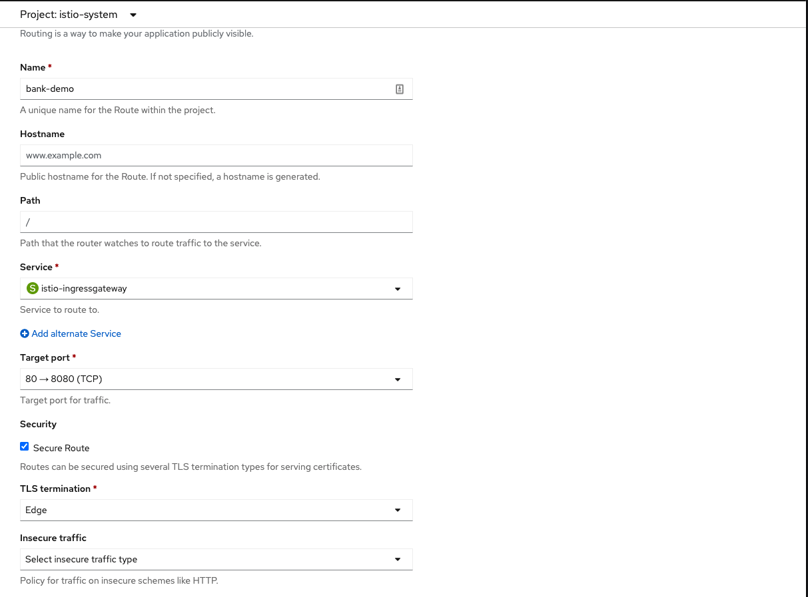

# Création du Project

Lors de cette section nous allons mettre en place les different service ainsi que le istio-ingress.

Se tutorial utilise le code fait avec `camel-springboot`.

## Étapes:

### Mettre en place les projects
* Créer un nouveau project dans laquelle deployé les differents services.
    * `Home -> Project -> Create Project`
        * `Nom:` uc1-zonea
        * `Display:` Use Case 1 Zone A

* Dans le command line aller au project uc1-zonea
```
oc project uc1-zonea
```

### Mettre en place les base de données

Pour que l'applicaiton roule nous devons avoir 2 base de données

Base de données Crédit
```
oc apply -k manifests/databases/sb/creditdb
```

Base de données Débit
```
oc apply -k manifests/databases/sb/debitdb
```

### Déployer le Transaction Service

 * Déployer le `DeploymentConfig` 
```
oc apply -f k8s/transaction-service/deploymentConfig.yaml
```
* Déployer le `Service`
 ```
 oc apply -f k8s/transaction-service/service.yaml
 ```
 
* Déployer le code
```
cd transaction-service/camel-springboot
```
```
mvn clean package fabric8:build -P openshift -Dmaven.test.skip
 ```

### Déployer le Credit Service

* Déployer le `DeploymentConfig` 
```
oc apply -f k8s/credit-service/deploymentConfig.yaml
```
* Déployer le `Service`
 ```
 oc apply -f k8s/credit-service/service.yaml
 ```

* Déployer le code
```
cd credit-service/camel-springboot
```
```
mvn clean package fabric8:build -P openshift -Dmaven.test.skip
 ```

#### Déployer le Debit Service

 * Déployer le `DeploymentConfig` 
```
oc apply -f k8s/debit-service/deploymentConfig.yaml
```
* Déployer le `Service`
 ```
 oc apply -f k8s/debit-service/service.yaml
 ```

* Déployer le code
```
cd debit-service/camel-springboot
```
```
mvn clean package fabric8:build -P openshift -Dmaven.test.skip
 ```


### Créer le Istio gateway
```
oc apply -f manifests/mesh/gateway.yaml
```

### Créer service virtuel creditservice
```
oc apply -f manifests/mesh/creditservice-vs.yaml
```

### Créer virtuel debitservice
```
oc apply -f manifests/mesh/debitservice-vs.yaml
```

## Faire un route HTTPS pour le istio-ingtressgateway

* `Name`: bank-demo
* `Service`: istio-ingressgateway
* `Target port`: 80 -> 8080(TCP)
* Select `Secure Route`
* `TLS termination`: Edge




:tada: FÉLICITATION

Il est maintenant possible de faire des tests avec la route qui vient d'être fait.