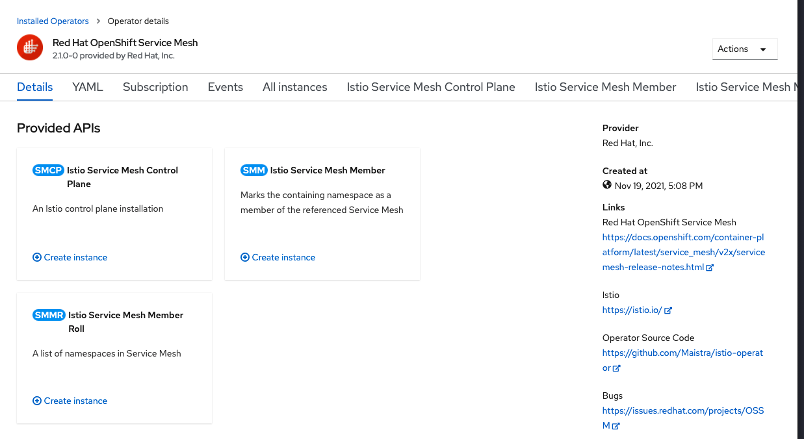
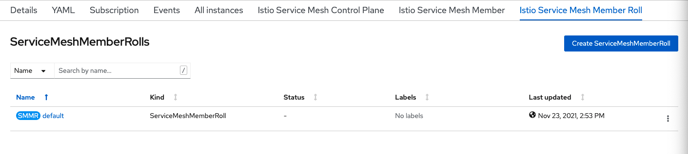
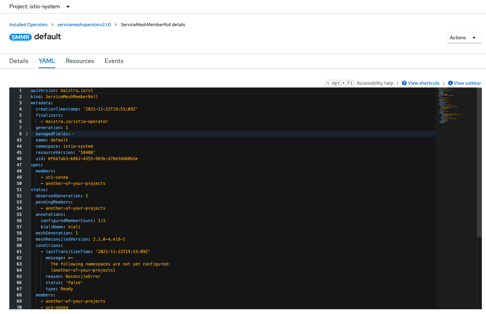

# Ajout d'un Member Roll au Service Mesh

Ajoutons maintenant un deuxième project à notre service mesh.

## Ajout du Project

### Mettre en place les projects
* Créer un nouveau project
    * `Home -> Project -> Create Project`
        * `Nom:` uc1-zoneb
        * `Display:` Use Case 1 Zone B

### Ajouter le project au Service Mesh

* Sélectionner le project créé plus haut.  `istio-system`.

* Allez dans les opérators installé. `Operators -> Installed Operators`

* Sélectionner `Red Hat OpenShift Service Mesh Operator.

* Dans `Istio Service Mesh Member Roll` Clicker sur `Service Mesh Member Rolls`

* Clicker sur YAML, pour l'éditer

* Ajouter le project, dans les sections `members` et `configuredMembers`. Le yaml devrait ressembler à ceci.
> apiVersion: maistra.io/v1
kind: ServiceMeshMemberRoll
metadata:
  creationTimestamp: '2021-11-23T19:53:09Z'
  finalizers:
    - maistra.io/istio-operator
  generation: 1
  managedFields:
    - apiVersion: maistra.io/v1
      fieldsType: FieldsV1
      fieldsV1:
        'f:spec':
          .: {}
          'f:members': {}
      manager: Mozilla
      operation: Update
      time: '2021-11-23T19:53:09Z'
    - apiVersion: maistra.io/v1
      fieldsType: FieldsV1
      fieldsV1:
        'f:metadata':
          'f:finalizers':
            .: {}
            'v:"maistra.io/istio-operator"': {}
        'f:status':
          'f:meshReconciledVersion': {}
          'f:members': {}
          'f:configuredMembers': {}
          'f:conditions': {}
          .: {}
          'f:memberStatuses': {}
          'f:terminatingMembers': {}
          'f:annotations':
            .: {}
            'f:configuredMemberCount': {}
            'f:kialiName': {}
          'f:observedGeneration': {}
          'f:pendingMembers': {}
          'f:meshGeneration': {}
      manager: istio-operator
      operation: Update
      time: '2021-11-23T19:53:09Z'
  name: default
  namespace: istio-system
  resourceVersion: '58408'
  uid: 0f66fab3-6862-4355-983b-d78e54d60b5e
spec:
  members:
    - uc1-zonea
    - uc1-zoneb
    - another-of-your-projects
status:
  observedGeneration: 1
  pendingMembers:
    - another-of-your-projects
  annotations:
    configuredMemberCount: 1/2
    kialiName: kiali
  meshGeneration: 1
  meshReconciledVersion: 2.1.0-4.el8-1
  conditions:
    - lastTransitionTime: '2021-11-23T19:53:09Z'
      message: >-
        The following namespaces are not yet configured:
        [another-of-your-projects]
      reason: ReconcileError
      status: 'False'
      type: Ready
  members:
    - another-of-your-projects
    - uc1-zonea
    - uc1-zoneb
  memberStatuses:
    - conditions:
        - lastTransitionTime: '2021-11-23T19:53:09Z'
          message: Namespace another-of-your-projects does not exist
          reason: NamespaceNotExists
          status: 'False'
          type: Reconciled
      namespace: another-of-your-projects
    - conditions:
        - lastTransitionTime: '2021-11-23T19:53:09Z'
          status: 'True'
          type: Reconciled
      namespace: uc1-zonea
  terminatingMembers: []
  configuredMembers:
    - uc1-zonea
    - uc1-zoneb

* Clicker sur `Save`

:tada: FÉLICITATION

Vous avez maintenant un deuxième project qui est pris en charge par le Service Mesh