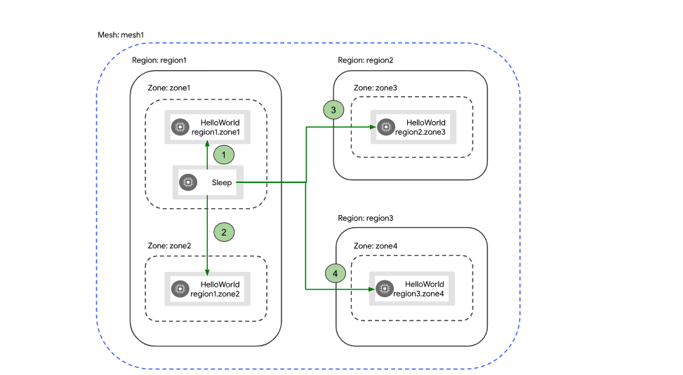

# Ajout d'un destination rules pour le Failover.

Dans cette section nous allons démontrer les capacité de Failover du Service Mesh. POur ce faire nous allon démontrer le failover Region1 -> zone1 vers zone2.



## Prérequis.
* Avoir le service `transactionservice` déployé dans notre cluster.
* Avoir le service 'creditservice' déployé dans notre cluster.
* Avoir seulement 1 version du service déployé.
* Avoir accès au cluster en `cli`.

## Étapes.

### Étape 1

* `Scale up` à 2 le déploiement de creditservice.

   OCP devrait distribuer le déploiment des `pods` dans 2 zones différente. 
   
   * La label `topology.kubernetes.io/zone` donne la zone.
   * La label `topology.kubernetes.io/region` donne la région.

   On peut obtenir les labels sur les pods avec cette commandes.
   ```
   oc get pods --show-labels | grep creditservice-v1
   ```

### Étape 2

* Mettre en place le VirtualService
```
oc create -f k8s/credit-service/virtual-service_v1.yaml
```

### Étape 3

* Tester le setrvice transaction.  Kubernetes devrait par défaut utiliser un méchanism de Round Robin.

### Étape 4


* Mettre en place le DestinationRule

Editer le destination rules pour mettre les bonne information des zone requise et le déployer.

```
oc create -f k8s/credit-service/destination-rule-failover.yaml
```

Maintenant le traffic devrait aller seulement dans 1 zone.

### Étape 5

* Tuer le pod dans la zone de référence, le traffic devrait aller dans la zone de fail over. Après environs 1 minutes le traffic devrait revenir dans la zone de référence.

:tada: FÉLICITATION

:point_right: Retour: [Démo](../README.md#demo)